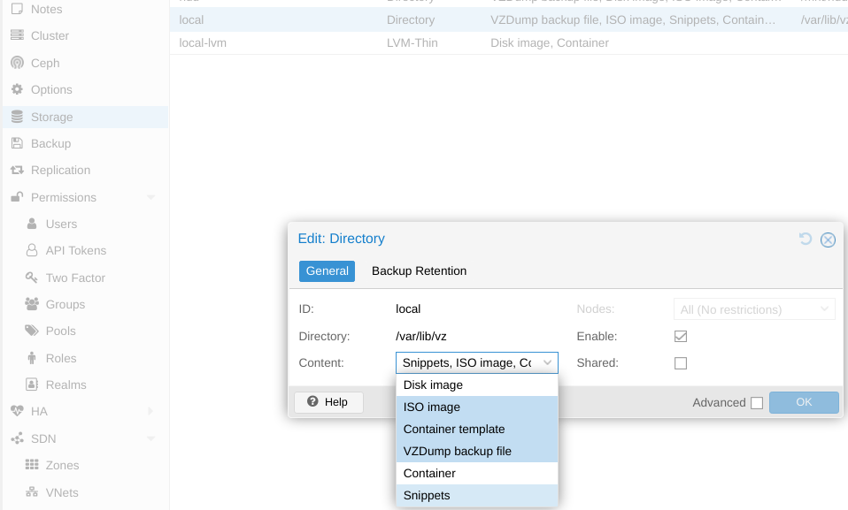

# Use Cloud-init yaml with Proxmox

## Introduction

https://pve.proxmox.com/wiki/Cloud-Init_Support
https://cloud-init.io/

In order to use Cloud-init with Proxmox, the following steps are recommended:
1. Get a dedicated Cloud-init image for the Linux distribution.
2. Use this image to build a template VM.
3. Provision servers by cloning the template VM and mounting the Cloud-init configuration, so that it will be applied during startup.

Multiple ways to provide Cloud-init configuration exist in Proxmox, also via GUI. Most cloud providers do support [yaml configuration files](https://cloudinit.readthedocs.io/en/latest/reference/examples.html) and this can be done in Proxmox as well - via [Custom Cloud-Init Configuration](https://pve.proxmox.com/wiki/Cloud-Init_Support#_custom_cloud_init_configuration).

Good to know:
- Cloud-init configuration files must be placed in the snippets directory of a Proxmox storage volume. This storage type is not enabled by default and must be added in e.g. "Datacenter" -> "Storage" -> Edit: local.

    - **In Proxmox clusters, these snippets must be accessible for all nodes in a shared storage, [Link](https://www.thomas-krenn.com/de/wiki/Custom_Cloud_Init_Config_in_Proxmox_VE#Snippet-Directory_erstellen).**
- Cloud-init configs for user data and networking must be split: `qm set 9000 --cicustom "user=<volume>,network=<volume>,meta=<volume>"`

## Usage

This repository provides scripts to provision *Debian 12* on a *single node* Proxmox in the default storage volume *local-lvm*.

Configs and .env for the provisioned VM in *./provision/1337* are exemplary and require modifications.

Cloud-init configs:
- [user data](./provision/1337/cloud-init.yml) e.g.:
    - set hostname
    - set up a user with SSH pubkey authentication and passwordless sudo
    - install various packages
    - create a swap file
    - mounts for /tmp and /dev/shm
    - disable cloudinit on subsequent boots
- [networking](./provision/1337/netplan.yml):
    - netplan for static IPv4 and DNS

```bash
# root@proxmox:~#
git clone https://github.com/martipoe/proxmox-cloudinit-debian
cd proxmox-cloudinit-debian

# create template vm
source /.env.template
bash ./1-template.sh

# provision from template vm
source ./cloudinit/1337/.env
bash ./2-provision.sh
```

## Inspired by

- https://github.com/chris2k20/proxmox-cloud-ini
